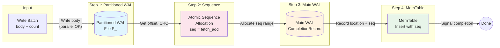
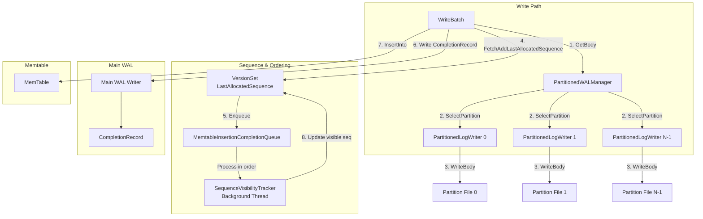
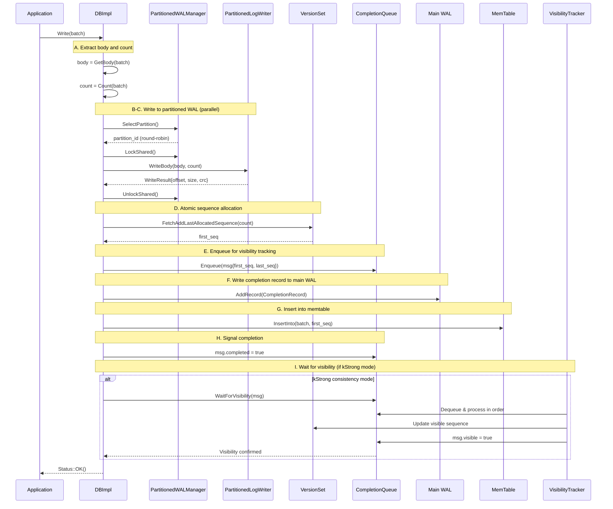
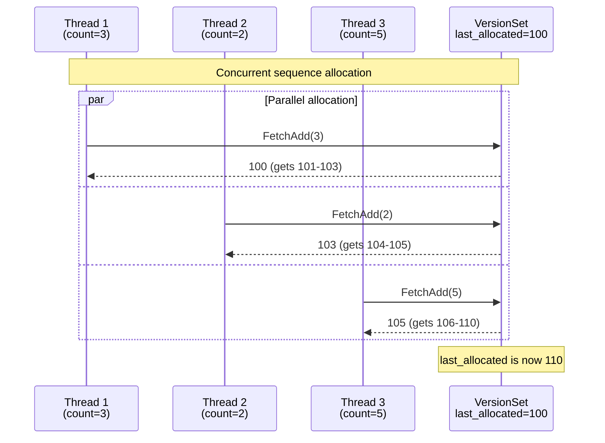
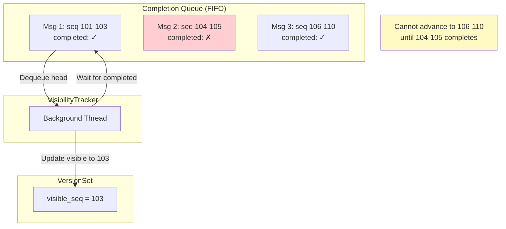
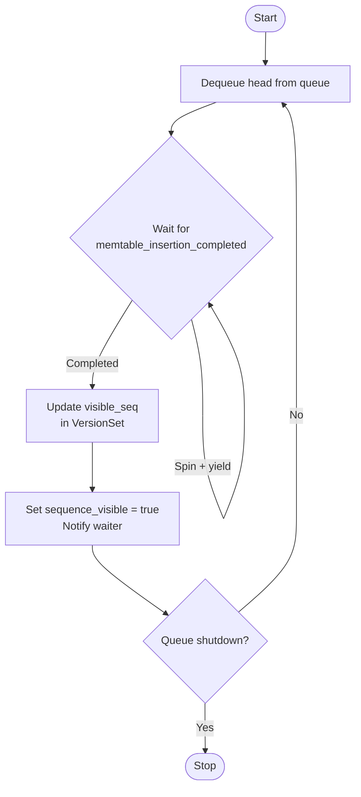
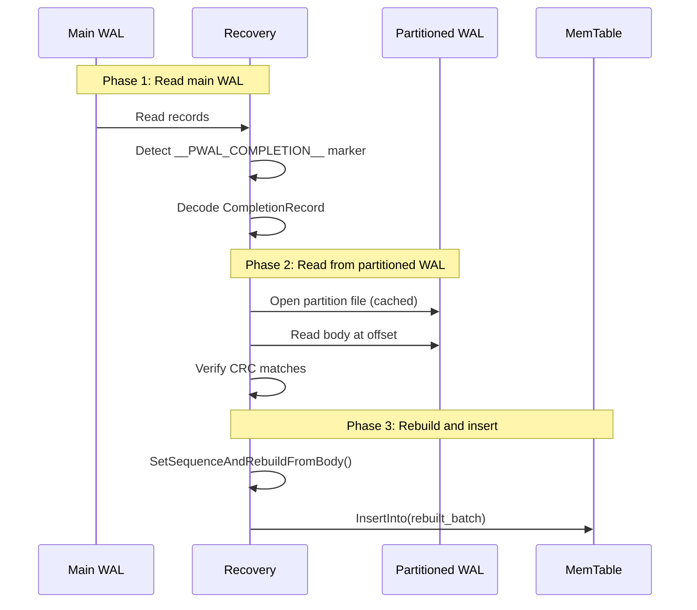

# Partitioned WAL: Design and Implementation

## Overview

Partitioned WAL is a feature designed to improve write throughput by distributing WAL writes across multiple partition files, reducing contention on a single WAL file. This document explains the architecture, write flow, sequence number management, and recovery process.

## Architecture

### Write Flow Overview

The following diagram illustrates the simplified flow of a write batch commit with Partitioned WAL:



**Key Insight**: The write to partitioned WAL happens *before* sequence number allocation, allowing multiple threads to write to different partitions in parallel. Sequence numbers are allocated atomically afterward, and the completion record in main WAL establishes the ordering.

### Component Overview

The partitioned WAL system consists of the following key components:



### Key Components

| Component | File | Purpose |
|-----------|------|---------|
| `PartitionedWALManager` | `db/partitioned_wal_manager.h` | Manages multiple partition writers, handles rotation |
| `PartitionedLogWriter` | `db/partitioned_log_writer.h` | Thread-safe writer for individual partition files |
| `MemtableInsertionCompletionQueue` | `db/memtable_insertion_completion_queue.h` | Queue for tracking insertion completion |
| `SequenceVisibilityTracker` | `db/sequence_visibility_tracker.h` | Background thread updating visible sequence |
| `CompletionRecord` | `db/partitioned_log_format.h` | Links partitioned WAL record to main WAL |

## Write Path Details

The write path is implemented in `DBImpl::WriteImplPartitionedWAL()` in `db/db_impl/db_impl_write.cc`.

### Detailed Write Sequence



### Step-by-Step Explanation

#### A. Extract Body and Count
```cpp
Slice body = WriteBatchInternal::GetBody(batch);
uint32_t count = WriteBatchInternal::Count(batch);
```
The body is the WriteBatch data without the 12-byte header (sequence number + count).

#### B-C. Write to Partitioned WAL
```cpp
uint32_t partition_id = partitioned_wal_manager_->SelectPartition();
log::PartitionedLogWriter* partition_writer =
    partitioned_wal_manager_->GetWriter(partition_id);
io_s = partition_writer->WriteBody(write_options, body, count, &wal_result);
```
- Partition selection uses atomic round-robin: `next_partition_.fetch_add(1) % num_partitions_`
- A shared lock is held during write to prevent rotation from invalidating the writer
- Multiple threads can write to different partitions concurrently

#### D. Atomic Sequence Number Allocation
```cpp
SequenceNumber first_seq = versions_->FetchAddLastAllocatedSequence(count) + 1;
```
This atomically allocates a contiguous range of `count` sequence numbers.

#### E. Enqueue for Visibility Tracking
```cpp
auto msg = std::make_shared<MemtableInsertionMessage>(first_seq, first_seq + count - 1);
memtable_completion_queue_->Enqueue(msg);
```
The message is enqueued to track when this write becomes visible.

#### F. Write Completion Record to Main WAL
```cpp
log::CompletionRecord completion;
completion.partition_wal_number = wal_result.GetEncodedWalNumber();
completion.partition_offset = wal_result.offset;
completion.body_size = wal_result.size;
completion.body_crc = wal_result.crc;
completion.record_count = wal_result.record_count;
completion.first_sequence = first_seq;
completion.last_sequence = first_seq + count - 1;
```
The completion record links the partitioned WAL data to sequence numbers.

#### G. Insert into Memtable
```cpp
WriteBatchInternal::SetSequence(batch, first_seq);
WriteBatchInternal::InsertInto(batch, &column_family_memtables, ...);
```
The batch is inserted with `concurrent_memtable_writes=true` since multiple threads may be inserting concurrently.

#### H-I. Signal Completion and Wait
```cpp
msg->memtable_insertion_completed.store(true, std::memory_order_release);
msg->cv.notify_one();

if (consistency_mode == kStrong) {
    memtable_completion_queue_->WaitForVisibility(msg);
}
```

## Sequence Number Generation

### Atomic Allocation

Sequence numbers are allocated atomically using `FetchAddLastAllocatedSequence`:



Each thread gets a non-overlapping sequence range. The order of allocation determines the logical order of writes.

### Visibility vs. Allocation

Two sequence numbers are tracked:
- **Last Allocated Sequence**: The highest sequence number that has been allocated (may not be visible yet)
- **Last Visible Sequence**: The highest sequence number that is guaranteed to be visible in reads

The `SequenceVisibilityTracker` ensures visibility is updated in allocation order:



## Main WAL Update

### CompletionRecord Format

The `CompletionRecord` is a 52-byte fixed-size structure written to the main WAL:

```
+------------------------+--------+
| Field                  | Size   |
+------------------------+--------+
| partition_wal_number   | 8 bytes|  Encoded: (log_number << 8) | partition_id
| partition_offset       | 8 bytes|  Offset in partition file
| body_size              | 8 bytes|  Size of write batch body
| body_crc               | 4 bytes|  CRC32C of body data
| record_count           | 4 bytes|  Number of key-value pairs
| first_sequence         | 8 bytes|  First sequence number
| last_sequence          | 8 bytes|  Last sequence number
| column_family_id       | 4 bytes|  Column family ID
+------------------------+--------+
Total: 52 bytes
```

### Main WAL Record Structure

The completion record is written as a special WriteBatch with a marker key:

```cpp
WriteBatch completion_batch;
completion_batch.Put(
    Slice("__PWAL_COMPLETION__"),
    Slice(completion_data));  // Encoded CompletionRecord
WriteBatchInternal::SetSequence(&completion_batch, first_seq);
main_wal_writer->AddRecord(completion_batch);
```

## Memtable Insertion

### Concurrent Writes

In partitioned WAL mode, multiple threads may insert into the memtable concurrently:

```cpp
WriteBatchInternal::InsertInto(
    batch, &column_family_memtables, ...,
    0,      // log_number = 0 for unconditional insertion
    true,   // concurrent_memtable_writes = true
    ...);
```

### Completion Signaling

After memtable insertion, the thread signals completion:

```cpp
msg->memtable_insertion_completed.store(true, std::memory_order_release);
msg->cv.notify_one();
```

The `SequenceVisibilityTracker` waits for this signal before advancing the visible sequence.

## Visibility Tracking

### SequenceVisibilityTracker Thread



### Consistency Modes

| Mode | Behavior | Use Case |
|------|----------|----------|
| `kStrong` | Wait for visibility before returning | Primary/leader instances requiring read-after-write |
| `kWeak` | Return immediately after WAL write | Replicas, write-heavy workloads without immediate reads |

## Recovery Process

### Recovery Flow



### Recovery Implementation

The recovery logic in `PartitionedWALRecovery::Recover()`:

1. **Sort completion records** by `first_sequence` (ascending order)
2. **For each completion record**:
   - Open the partitioned WAL file (cached for reuse)
   - Read the body at `partition_offset`
   - Verify CRC: `ValidateBodyCRC(body_data)`
   - Rebuild WriteBatch: `SetSequenceAndRebuildFromBody(batch, first_sequence, body)`
   - Insert into memtable
3. **Return maximum recovered sequence**

### Upgrade/Downgrade Support

- **Upgrade** (traditional WAL → partitioned WAL): Traditional WAL recovery happens first, then partitioned WAL components are initialized
- **Downgrade** (partitioned WAL → traditional WAL): Completion records are still processed, then partitioned WAL files are cleaned up

## Configuration Options

| Option | Default | Description |
|--------|---------|-------------|
| `enable_partitioned_wal` | `false` | Enable partitioned WAL feature |
| `num_partitioned_wal_writers` | `4` | Number of partition files |
| `partitioned_wal_consistency_mode` | `kStrong` | Visibility waiting mode |
| `partitioned_wal_sync_interval_ms` | `1000` | Interval between WAL syncs |
| `partitioned_wal_max_file_size` | `100MB` | Max size before rotation (80% triggers flush) |

### Example Configuration

```cpp
Options options;
options.enable_partitioned_wal = true;
options.num_partitioned_wal_writers = 8;  // More partitions for higher parallelism
options.partitioned_wal_consistency_mode = PartitionedWALConsistencyMode::kStrong;
options.partitioned_wal_sync_interval_ms = 500;  // Sync every 500ms
options.partitioned_wal_max_file_size = 64 * 1024 * 1024;  // 64MB per partition
```

## Statistics

New statistics for monitoring partitioned WAL:

| Statistic | Description |
|-----------|-------------|
| `PARTITIONED_WAL_WRITES` | Total number of partitioned WAL writes |
| `PARTITIONED_WAL_BYTES_WRITTEN` | Total bytes written to partitioned WAL |
| `PARTITIONED_WAL_COMPLETION_RECORDS` | Number of completion records written |
| `PARTITIONED_WAL_WRITE_LATENCY` | Overall write latency histogram |
| `PARTITIONED_WAL_SEQUENCE_ALLOC_LATENCY` | Sequence allocation latency |
| `PARTITIONED_WAL_VISIBILITY_WAIT_MICROS` | Time spent waiting for visibility |

## File Naming Convention

Partitioned WAL files follow this naming pattern:
```
PARTITIONED_XXXXX_PY.log
```
Where:
- `XXXXX` is the zero-padded log number (e.g., `00042`)
- `Y` is the partition ID (e.g., `0`, `1`, `2`, ...)

Example files for log number 42 with 4 partitions:
```
PARTITIONED_00042_P0.log
PARTITIONED_00042_P1.log
PARTITIONED_00042_P2.log
PARTITIONED_00042_P3.log
```

## Thread Safety Summary

| Component | Thread Safety |
|-----------|---------------|
| `PartitionedLogWriter::WriteBody()` | Thread-safe (internal mutex) |
| `PartitionedWALManager::SelectPartition()` | Thread-safe (atomic counter) |
| `PartitionedWALManager::GetWriter()` | Requires shared lock held |
| `MemtableInsertionCompletionQueue` | Thread-safe (all methods) |
| `SequenceVisibilityTracker` | Single background thread |
| Main WAL write | Protected by `wal_write_mutex_` |
